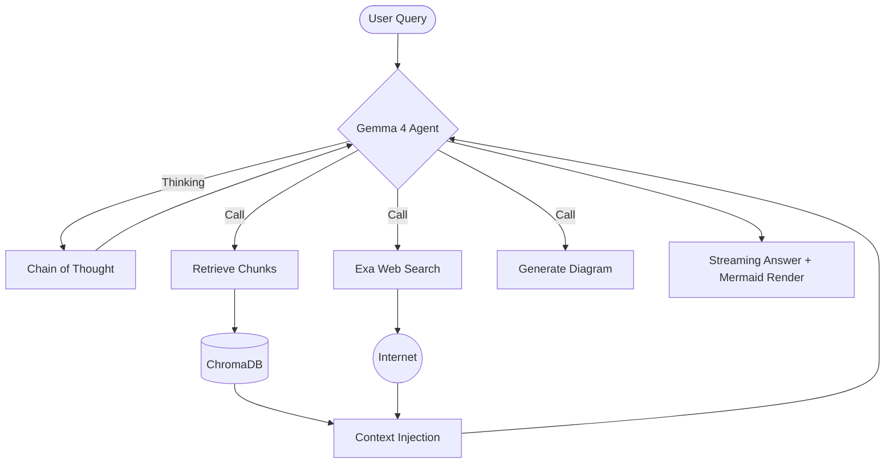

# 📄 PDF-QA System: Agentic RAG with Gemma 4

[](https://fastapi.tiangolo.com/)
[](https://reactjs.org/)
[](https://ollama.com/)
[](https://python.langchain.com/)
[](https://tailwindcss.com/)

An AI-powered, agentic Question-Answering system for PDF documents. Experience high-quality, private, and local-first RAG using **Gemma 4**'s advanced thinking capabilities and tool-calling power.

---

## ✨ Key Features

*   🧠 **Advanced Thinking Mode**: Leverages Gemma 4's `<|think|>` tokens to reason through complex academic questions before responding.
*   🖼️ **Multimodal Intelligence**: Upload images alongside your text to get visual-context-aware answers.
*   📊 **Auto-Diagram Generation**: Automatically generates and renders **Mermaid.js** flowcharts and diagrams from your notes.
*   🌐 **Hybrid Search**: Intelligent agentic loop that uses local ChromaDB for notes and falls back to **Exa Web Search** for up-to-date information.
*   🔒 **Local-First & Private**: Run your LLM and Vector Store locally via Ollama and ChromaDB—your data stays yours.
*   ⚡ **Streaming Responses**: Real-time token streaming for a snappy, Claude-like chat experience.

---

## 🚀 Ridiculously Easy Onboarding

Get up and running in minutes with our automated setup.

### 1. Prerequisites
*   **Python** >= 3.9
*   **Node.js** >= 18
*   **Ollama**: [Download here](https://ollama.com/) and run `ollama run gemma4:e2b`

### 2. One-Command Setup
```bash
# Clone the repo
git clone <your-repo-link>
cd "PDF-QA system"

# Run the setup script
chmod +x setup.sh
./setup.sh
```

### 3. Verify Your Environment
```bash
python3 verify_setup.py
```

---

## 🏗️ System Architecture

The system follows an agentic RAG (Retrieval-Augmented Generation) workflow, where the LLM decides which tools to use based on the user's query.



---

## 🧠 Agentic Intelligence

This isn't just a simple prompt-response app. Our agent uses a sophisticated loop:

1.  **Thinking**: The model uses a hidden thought channel to plan its tool usage.
2.  **Tool Selection**: It chooses between `retrieve_chunks`, `web_search`, `list_topics`, or `generate_diagram`.
3.  **Observation**: It analyzes the output of the tools.
4.  **Final Response**: It synthesizes a final answer, often including rendered diagrams or structured tables.

---

## 🛠️ Tech Stack

### Backend
- **FastAPI**: Asynchronous high-performance web framework.
- **LangChain**: Orchestration of the agentic loop and RAG pipeline.
- **ChromaDB**: Local vector store for document embeddings.
- **Gemma 4 (Ollama)**: State-of-the-art open-weight LLM for reasoning and tool calling.
- **Gemini 2.5 Flash**: High-speed PDF processing and extraction.

### Frontend
- **React (Vite)**: Modern, reactive user interface.
- **Zustand**: Lightweight state management.
- **Tailwind CSS**: Professional styling with custom glassmorphism.
- **Mermaid.js**: Dynamic rendering of AI-generated diagrams.

---

## 📂 Project Structure

```text
├── backend/            # FastAPI app & Core AI logic
│   ├── core/           # RAG, Agent, Tools & Embeddings
│   ├── routers/        # API Endpoints
│   └── data/           # Local storage (ChromaDB, Sessions)
├── frontend/           # React SPA
│   ├── src/components/ # UI Components (Chat, Sidebar, etc.)
│   ├── src/store/      # Global State (Zustand)
│   └── src/hooks/      # Custom Hooks (WebSockets)
├── docs/               # Technical Documentation
└── setup.sh            # Automated installation script
```

---

## ⭐️ Support the Project
If you find this project useful, please give it a star! It helps others discover the power of local Agentic RAG.
